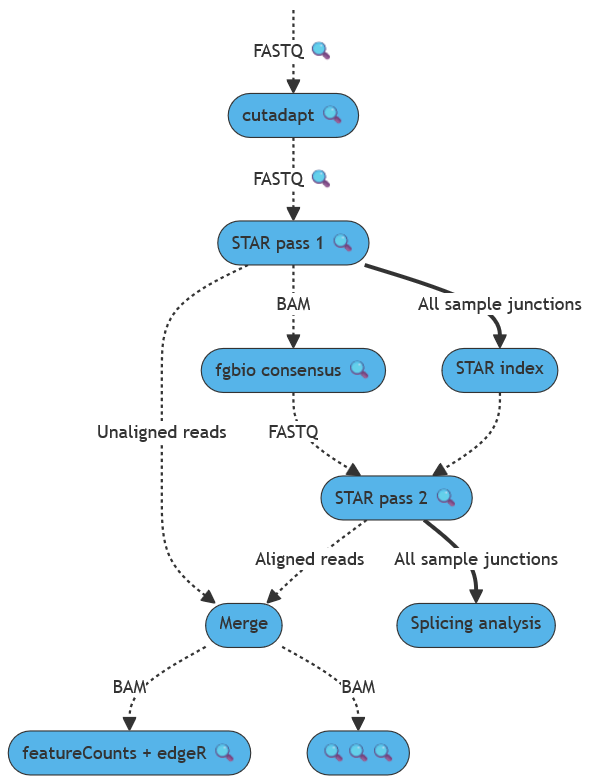

# Splicing Analysis with Molecular Indexes (SAMI)
A nextflow pipeline to handle RNA-seq data from FASTQ files to end results, with a special focus on splicing and gene-fusion events.

https://gitlab.inria.fr/HCL/pipelines/SAMI.git





## Quick start


### Dependencies

* Nextflow (tested with version `24.04.4-all`)
* Singularity (tested with version `CE 3.8.0`)


### Building the Singularity container

`sudo singularity build SAMI.sif SAMI.def`


### Annotation files to download (and gunzip) manually

#### GENCODE annotation

- Browse https://www.gencodegenes.org/human/ for latest versions.
- **Reference genome**, as a single FASTA file :
   - [GRCh38.primary_assembly.genome.fa.gz](http://ftp.ebi.ac.uk/pub/databases/gencode/Gencode_human/release_41/GRCh38.primary_assembly.genome.fa.gz)
- **Reference transcriptome**, as a single GTF file :
   - [gencode.v44.primary_assembly.annotation.gtf.gz](http://ftp.ebi.ac.uk/pub/databases/gencode/Gencode_human/release_44/gencode.v44.primary_assembly.annotation.gtf.gz)

#### NCBI annotation

- Browse https://www.ncbi.nlm.nih.gov/projects/genome/guide/human/index.shtml for latest versions.
- **Reference genome**, as a single FASTA file :
   - [GCA_000001405.15_GRCh38_full_analysis_set.fna.gz](https://ftp.ncbi.nlm.nih.gov/genomes/all/GCA/000/001/405/GCA_000001405.15_GRCh38/seqs_for_alignment_pipelines.ucsc_ids/GCA_000001405.15_GRCh38_full_analysis_set.fna.gz)
- **Reference transcriptome**, as a single GTF file :
   - [GCA_000001405.15_GRCh38_full_analysis_set.refseq_annotation.gtf.gz](https://ftp.ncbi.nlm.nih.gov/genomes/all/GCA/000/001/405/GCA_000001405.15_GRCh38/seqs_for_alignment_pipelines.ucsc_ids/GCA_000001405.15_GRCh38_full_analysis_set.refseq_annotation.gtf.gz)

#### Common files for variant-calling

- **COSMIC coding mutations**, as a **bgzip-recompressed and indexed** VCF file :
   - [CosmicCodingMuts.normal.vcf.gz](https://cancer.sanger.ac.uk/cosmic/archive-download) ("VCF files", registration required)

- **gnomAD polymorphisms**, as a bgzip compressed and indexed VCF file :
   - [af-only-gnomad.hg38.vcf.gz](https://www.bcgsc.ca/downloads/morinlab/reference/af-only-gnomad.hg38.vcf.gz)


### Processing a run (example data provided)

```bash
#!/bin/bash

# Annotation files (to download manually first)
genome="store/GCA_000001405.15_GRCh38_full_analysis_set.fna"
GTF="store/GCA_000001405.15_GRCh38_full_analysis_set.refseq_annotation.gtf"

# Launch pipeline
nextflow run main.nf -with-singularity "SAMI.sif" \
   --genomeFASTA "$genome" --genomeGTF "$GTF" --title "MET" --input "data/test-MET/samples.csv" --out "./out" \
   -stranded "R2" --umi --umi_length 6 --trimR1 'AGATCGGAAGAGCACACGTCTGAACTCCAGTCA' --trimR2 'AGATCGGAAGAGCGTCGTGTAGGGAAAGAGTGT'
```

## Argument description

### Main arguments

| Argument | Default value | Description |
| :-- | :-- | :-- |
| \--input | \<none but required\> | Sample sheet describing FASTQ files (comma separated, with named columns "sample", "R1" and "R2"). Single-end data can be used, just leaving "R2" empty. |
| \--title | \<none but required\> | Series’ name, to print on MultiQC report and use in file names. |
| \--genomeFASTA | \<none but required\> | Multi-FASTA file containing all chromosomes of the genomic reeference, for alignment (see example above). |
| \--genomeGTF | \<none but required\> | GTF file describing genes, transcripts and exons for the whole transcriptome (see example above). |
| \--targetGTF | \--genomeGTF | GTF file describing genes, transcripts and exons for the captured genes of interest (can be the whole transcriptome). |
| \--species | "Human" | Name of the sample species, for file annotation. |
| \--genome | "GRCh38" | Name of the assembly of reference genome used, for file annotation. |
| \--chromosomes | "1,2,3,4,5,6,7,8,9,10,11,12,13,14,15,16,17,18,19,20,21,22,X,Y" | Ordered list of chromosomes to consider during the analysis. |
| \--CN | \<none\> | Sequencing center name (to populate the CN field in @RG of BAM files) |
| \--PL | "ILLUMINA" | Sequencing technology used (to populate the PL field in @RG of BAM files, see SAM file specification for allowed values) |
| \--PM | \<none\> | Sequencer model name (to populate the PM field in @RG of BAM files) |
| \--stranded | "no" | Whether a stranded RNA-seq library was used or not ("no", "R1" or "R2"), mainly used during QC. |
| \--store | "./store" | Path to long term storage for processed annotation files, to speed-up consecutive launchs of the pipeline. |
| \--out | "./out" | Path to output directory, where files of interest are published. |
| \--publish | "copy" | Publishing mode for output files (see Nextflow documentation). |
| \--MQC\_title | \--title | Title for the MultiQC report. |
| \--MQC\_comment | \<none\> | Free comment to add at the beginning of the MultiQC report. |

### Adapter trimming (optional)

| Argument | Default value | Description |
| :-- | :-- | :-- |
| \--trimR1 | \<none\> | Sequence to trim in 3’ of R1 (cutadapt -a). |
| \--trimR2 | \<none\> | Sequence to trim in 3’ of R2 (cutadapt -A). |

### UMI-based deduplication (optional)

| Argument | Default value | Description |
| :-- | :-- | :-- |
| \--umi | false | Whether to deduplicate reads based on pass 1 STAR alignment and UMI content (consensus read) or not. |
| \--umi\_length | 0 | Length of UMIs, only if they were located in 5’ of both R1 and R2 and extracted from the reads prior to launching SAMI (alignment parameters will be adjusted accordingly). Otherwise use 0. |

### Aberrant splicing analysis (optional)

| Argument | Default value | Description |
| :-- | :-- | :-- |
| \--splicing | true | Whether to look for aberrant splicing events or not. |
| \--min\_PSI | 0.1 | Minimum Percentage Spliced In (PSI) to retain an aberrant junction as a candidate (between 0 and 1). |
| \--min\_I | 30 | Minimum amount of (deduplicated) reads supporting an aberrant junction to retain it as a candidate. |
| \--min\_reads\_unknown | 10 | "Unknown" junctions without this amount of reads or more in at least one sample will be ignored (significantly reduces computing time). |
| \--plot | true | Whether to produce plots of genes and samples with at least one junction passing filters or not. |
| \--fusions | true | Whether to call gene-fusions or only splicing events inside genes. |
| \--classes | plausible,anchored | Annotation support to retain a junction as a candidate : "annotated" (junction described in annotation), "plausible" (both splicing sites are known, but the junction itself is not), "anchored" (one splicing site is known) or "unknwon" (none of the splicing sites is known). |
| \--focus | "none" | Retain only these junctions as candidates (comma-separated list). |
| \--transcripts | \<none\> | Preferred transcripts to focus on (tab-separated file without header, with gene symbols in first column and transcript ID in second column). |
| \--symbols | "target" | Only junctions in these genes will be retained as candidates (use "all" to disable the filtering, or "target" to refer to genes defined in –targetGTF). |

### SNV and short-indel calling (experimental and optional)

| Argument | Default value | Description |
| :-- | :-- | :-- |
| \--varcall | false | Whether to perform SNV and short indel calling or not. |
| \--COSMIC | \<none but required\> | VCF file of known pathogenic variants (bgzipped and TBI indexed) |
| \--gnomAD | \<none but required\> | VCF file of known polymorphisms (bgzipped and TBI indexed) |
| \--window | \<none\> | Genomic window in which to perform the variant calling (to speed-up tests mainly, leave empty to call in the entire genome). |
